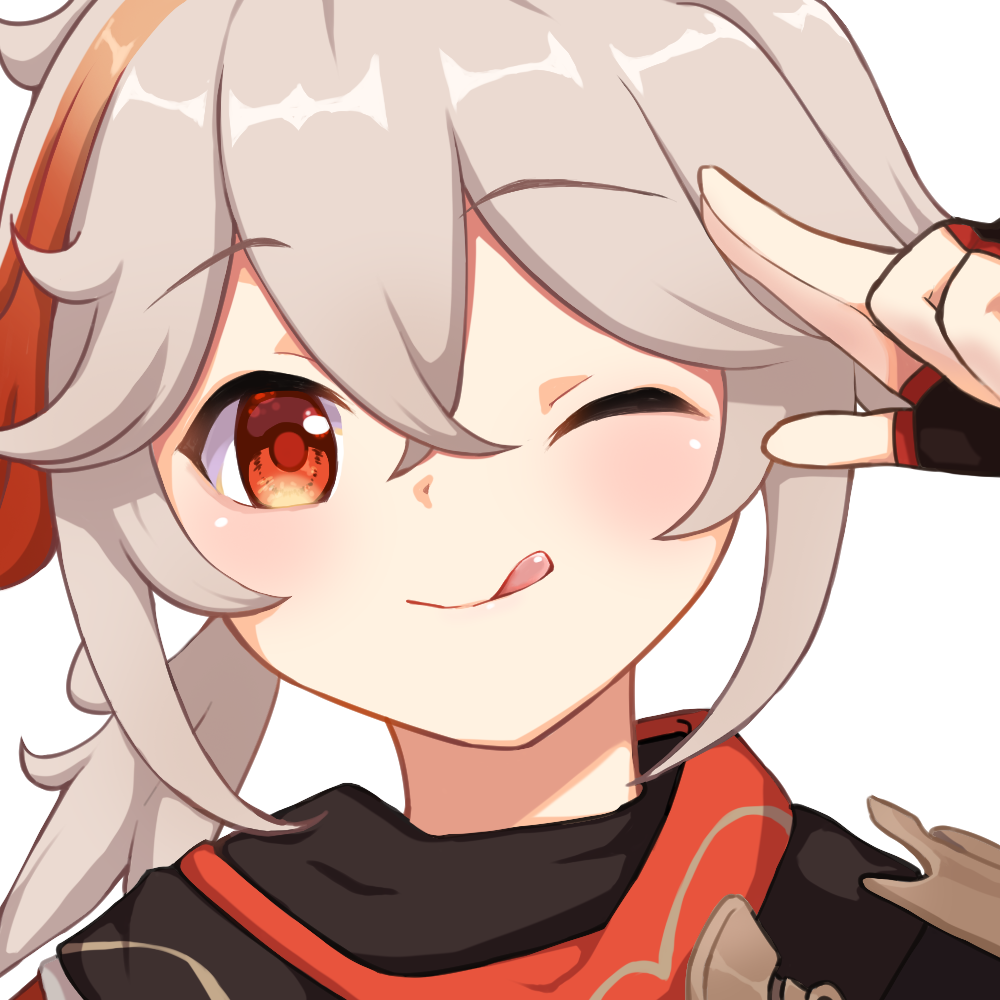

  

### Hello there, see about me below:
- 🌱 I’m currently learning **Go** 
- 🤔 I’m looking for help with making an RPG Based Text game for my Telegram bot. 
- ⚡ Fun fact: Fanarts Lover
- 🎮 Playing: [**Genshin Impact**](https://github.com/rushkii/kiizuha-genshin/blob/master/README.md), Tower of Fantasy, Dota 2, Mobile Legends: Bang Bang, and other offline games.

  <b>My Statistic</b>

   

  <b>My Languages</b>

  

  <b>Reach me on:</b>

  

<b>Arigatoouuuu (^_^)</b>

  

