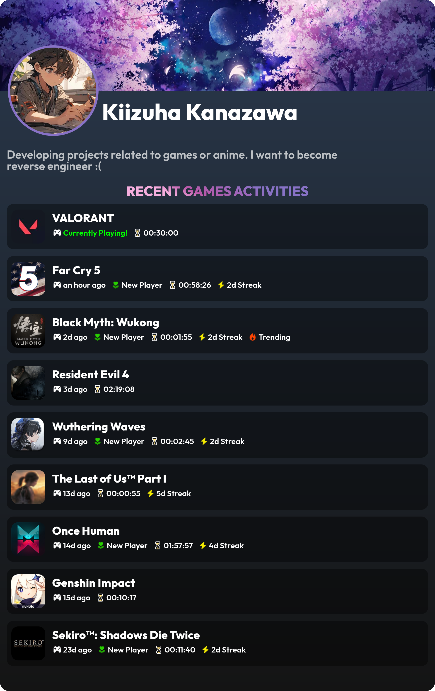

  <i>
    See my Valorant's statistic <a href="https://github.com/rushkii/my-valo-stats">here</a>
     
    Image above was generated by <a href="./generate.js">this magic code</a>.
  </i>

---

### Hi there 👋😄

I'm **Kiizuha Kanazawa** ([**22**](https://github.com/rushkii/rushkii/commit/b03996bb1be1d5a908fa5f1740be2147426dd3a2) y.o)! I live in Tangerang, Indonesia. 😋 
_I'd love to create project that has relation to games or anything I like now._

#### :computer: I'm currently learning:

#### 🛠 Tools that I'm using:

#### 💡 My projects:
- hbd-feilynn: [source](https://github.com/rushkii/hbd-feylynn) | [demo](https://hbd-feylynn.vercel.app)
- lore-daemon: [source](https://github.com/ammarfaizi2/lore-daemon) | [demo](https://t.me/GNUWeeb/935728)
- palo: [source](https://github.com/rushkii/palo) | [demo](https://palo.vercel.app) (not finished)
- nekopoi-api: [source](https://github.com/rushkii/nekopoi-py)
- www.gnuweeb.org: [source](https://github.com/GNUWeeb/www.gnuweeb.org) | [demo](https://www.gnuweeb.org)
- pixiv-sketch-svelte: [source](https://github.com/rushkii/pixiv-sketch-svelte)
- dota2clone: [source](https://github.com/rushkii/dota2clone) | [demo](https://dota2clone.vercel.app)
- march7th-svelte: [source](https://github.com/rushkii/march7th-svelte)

#### 🏆 Github Stats

#### 🤙 Reach me on:

